# Project Kerja Praktek Sistem Pengaduan Masyarakat Berbasis Web Dispendukcapil Bangkalan

## Language

-  
- 
- 
-  
-  

## Screenshot

- ### Admin

    - Login

        

    - Dashboard

        
        
    - Kelola

        
        
    - Hapus Laporan

        
        
    - Balas Laporan

        
        
    - Detail Laporan

        
        
    - Ekspor

        
        
    - Print

        
        
- ### User

    - Home

        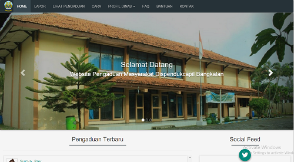
        
        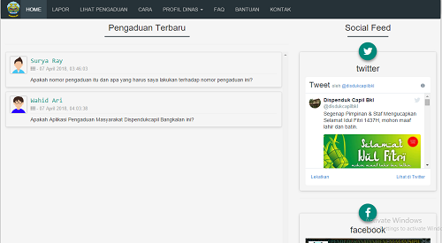
        
    - Lapor

        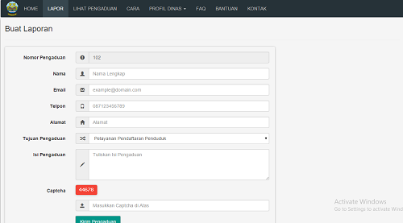
        
    - Lihat

        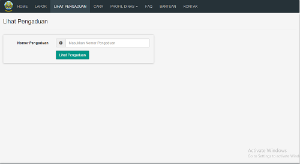

        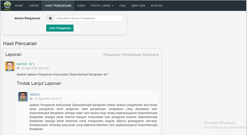
        
    - Cara

        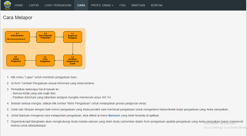
        
    - FAQ

        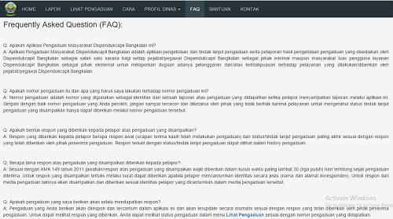
        
    - Bantuan

        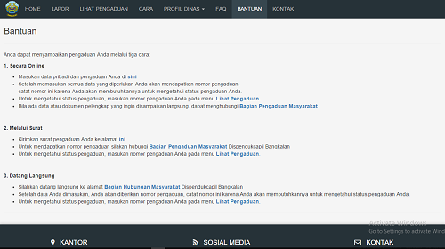
        
    - Kontak

        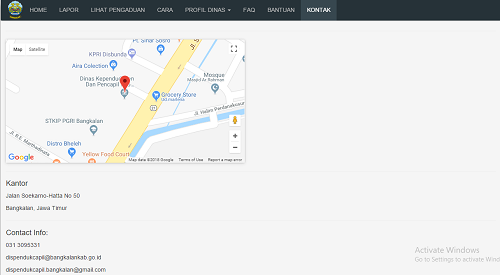
        
    - Profil Dinas

        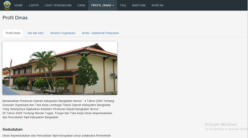
        
        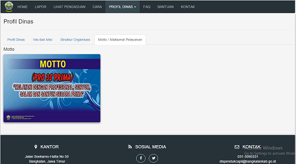
        
        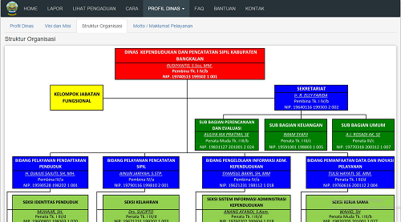
        
        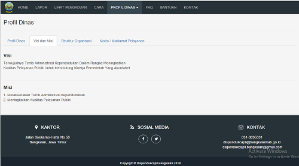
    
    
## License
> This program is Free Software: 
You can use, study, share and improve it at your will. 
Specifically you can redistribute and/or modify it under the terms of the [GNU General Public License](https://www.gnu.org/licenses/gpl.html) 
as published by the Free Software Foundation, either version 3 of the License, or (at your option) any later version.
